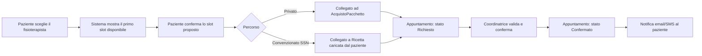

# Architettura — Rimettimi in sesto

Per i requisiti funzionali e non funzionali vedi [requisiti.md](requisiti.md).

## Stack tecnico

Scelta motivata da: singolo studio (carico contenuto), hosting su Microsoft Azure, presenza di dati sanitari (categoria particolare GDPR), team di sviluppo presumibilmente piccolo.

| Livello | Scelta | Perché |
|---|---|---|
| Backend | ASP.NET Core Web API (.NET 8, C#) | Integrazione nativa con Azure, tooling maturo, RBAC e sicurezza di primo livello |
| Frontend | React + TypeScript (SPA) | Ampia disponibilità di componenti per calendario/booking, ecosistema ampio |
| Database | Azure SQL Database, via Entity Framework Core — **ma la demo pubblicata usa SQLite anche in produzione**, per scelta: vedi "Note per il deploy demo" | Gestito, cifratura at-rest nativa (TDE), integrazione diretta con .NET |
| Autenticazione | ASP.NET Core Identity + ruoli, JWT verso la SPA | RBAC nativo per i 4 ruoli; possibile evoluzione a Microsoft Entra External ID |
| Storage allegati | Azure Blob Storage | Per referti/documenti caricati da pazienti o fisioterapisti |
| Email | Azure Communication Services Email (alt.: SendGrid) | Conferme e promemoria |
| SMS | Azure Communication Services SMS (alt.: Twilio) | Promemoria via SMS |
| Pagamenti online | Stripe (Checkout / Payment Intents) | Acquisto pacchetti sedute online; il pagamento in studio resta un flusso manuale registrato da coordinatrice/admin |
| Hosting | Azure App Service (API + frontend, o frontend su Azure Static Web Apps) | Coerente con la scelta di hosting Azure |
| Segreti | Azure Key Vault | Connection string, chiavi Stripe, credenziali provider email/SMS |
| CI/CD | GitHub Actions → Azure | Deploy automatico |
| Monitoring | Azure Application Insights | Log, errori, performance |

Queste sono scelte di partenza per l'MVP di un singolo studio: sono revisionabili quando si arriva allo scaffolding, non vincoli rigidi.

**Componenti UI**: shadcn/ui su Tailwind CSS — componenti copiati nel progetto (nessuna dipendenza runtime), nativi Tailwind, massimo controllo sul codice. Per la vista agenda (centrale in più ruoli): **react-big-calendar** (gratuita, licenza MIT).

## Identità visiva

Ispirata al materiale di brand di uno studio reale preso a modello per il progetto (nome, logo e materiali originali sono rimasti nel repository privato): non una palette inventata a tavolino, ma nemmeno riproducibile a ritroso da questi soli valori.

| Token | Valore (tema chiaro) | Uso |
|---|---|---|
| `--accent` | `#2f5fa8` | Blu istituzionale del brand — elementi interattivi, tab attiva |
| `--accent-deep` | `#1e3a63` | Blu notte della stessa famiglia, per superfici piene ampie: la saturazione alta su grandi aree legge come "modello preconfezionato", il tono profondo come sartoriale |
| `--good` | `#2f8f5b` | Verde — **solo per stato "confermato"**, volutamente distinto dall'accent: un pulsante attivo e un appuntamento confermato non devono sembrare la stessa cosa |
| `--warm` | `#c97d06` | Ambra — stato "in attesa/richiesta", coerente con un accento già presente nel brand originale |
| `--bg` | `#f6f1e8` | Avorio caldo — la "carta" della pagina |
| `--surface` | `#ffffff` | Bianco puro — schede, testata, sidebar: la struttura si stacca dalla carta senza bisogno di bordi |
| `--surface-2` | `#efe8dd` | Sabbia — superfici incassate (toggle, campi, celle di intestazione) |
| `--border` | `#e9e3d9` | Filo caldo, quasi subliminale |
| `--ink` / `--muted` | `#1c2733` / `#5b6470` | Testo principale / secondario — restano **freddi** |

**Carta calda, inchiostro freddo** (deciso l'8 settembre 2026, applicato a tutti e quattro i mockup di design). I colori del brand non sono stati toccati: a cambiare sono solo i neutri, che la versione precedente lasciava genericamente su "bianco / grigio chiaro" — un bianco che tirava all'azzurro, da gestionale sanitario. L'avorio caldo con testo blu-navy freddo è il contrasto della carta intestata di pregio, e fa risaltare il blu del brand più di quanto facesse su grigio freddo.

**Il marchio, invece, è stato tolto dalla versione pubblicata** (15 settembre 2026). La palette qui sopra resta identica — nasce dal brand reale ed è la ragione per cui il blu è quello — ma la demo online non porta nome e logo dello studio: mostra un **simbolo astratto in SVG** (`frontend/src/assets/logo.svg`) e si chiama solo "Rimettimi in sesto". Motivo: un marchio sanitario reale su un indirizzo condiviso `*.azurewebsites.net`, sopra un modulo email/password, è il profilo che i classificatori antifrode leggono come pagina clone — ed è quello che è successo (vedi [DEVLOG.md](DEVLOG.md)). Il logo reale resta solo nei mockup di design, non pubblicati in questo repository.

**Tema scuro spento in produzione**: `index.html` porta `data-theme="light"`, quindi la demo appare uguale a chiunque la apra, anche da un telefono impostato in modalità scura. I token del tema scuro restano definiti in `index.css` e si riaccendono togliendo quell'attributo.

Conseguenze di sistema, valide per l'implementazione futura:
- **Le schede non hanno cornice** in tema chiaro: le definisce un'ombra larga e tenue, di tono caldo (`--card-border` vale `transparent`). Al buio le ombre non si leggono, quindi lì il bordo torna (`--card-border` prende il valore di `--border`).
- **Gli stati sono un puntino colorato più testo sobrio**, non pastiglie piene. Eccezione deliberata: le pastiglie del calendario nella vista Coordinatrice restano piene, perché lì il colore serve a scandagliare una griglia densa, non a etichettare una riga.
- **Scala di elevazione a tre livelli** (`--shadow-sm/md/lg`) invece di un'unica ombra piatta, e transizioni sotto i 200 ms (`--transition`) su tutti gli elementi cliccabili.

Tipografia, tre voci con tre ruoli distinti:
- **Petrona** (serif) — la *voce*: titoli di pagina, iniziali negli avatar, cifre importanti (importi, valori nei riquadri statistici). Usato con parsimonia: un serif ovunque è dozzinale, un serif in due punti è ricercato.
- **Montserrat** (ripresa dal materiale di brand originale) — la *struttura*: etichette in maiuscoletto molto spaziato (`letter-spacing: .14em`), intestazioni di tabella, titoli di sezione.
- **Karla** — la *sostanza*: corpo del testo e interfaccia.
- **IBM Plex Mono** — i *dati incolonnati*: orari nelle griglie, colonne di date. Non le date discorsive sotto un nome, che nel monospaziato suonano da terminale.

**Icone**: [Tabler Icons](https://tabler.io/icons) (MIT, griglia 24×24 e tratto 2px costanti), caricate come webfont da CDN. Sostituiscono le icone disegnate a mano, che avevano spessori di tratto incoerenti fra loro.

Palette dark-mode derivata dagli stessi token (non un tema separato inventato): carbone caldo con testo avorio, stessa logica invertita. Dettaglio completo e mockup navigabili nei prototipi HTML prodotti durante la fase di design — non pubblicati qui perché portano ancora il marchio reale, ma questa sezione resta il riferimento da mantenere aggiornato se la direzione visiva cambia.

## Modello dati ad alto livello

Entità principali (schema concettuale, non ancora schema SQL):

- **Utente** — base comune: email, ruolo, nome, cognome, telefono. **Un `Utente` può avere più `Paziente` collegati** (sé stesso, un figlio minore, un genitore anziano): prenota per ciascuno, ne riceve le notifiche e presta i consensi dove ne ha titolo. La relazione porta con sé il titolo con cui l'utente agisce (sé stesso / genitore / tutore), perché è quello che i moduli di consenso richiedono di dichiarare.
- **Paziente** — dati anagrafici, codice fiscale, consensi privacy/dati sanitari con data e versione, **stato** (provvisorio / consenso raccolto). Non ha più un `fisioterapistaDiRiferimento` come FK fissa (vedi "Relazione chiave" sotto). **Non estende più `Utente` in modo obbligatorio**: una scheda anagrafica può esistere senza credenziali di accesso (creata dalla Coordinatrice per una prenotazione telefonica), con `Utente` collegato in un secondo momento se e quando il paziente si registra online. Il collegamento a un `Utente` esistente avviene per codice fiscale, con conferma esplicita se il match è solo su nome+cognome+telefono.
- **NotaOperativa** *(nuova entità)* — paziente, testo, autore, data. Note della Coordinatrice sul paziente (es. "spesso in ritardo") **separate** da `CartellaClinica`/`NotaSeduta`: campo distinto, mai clinico, per non violare la regola di accesso ai dati sanitari.
- **Fisioterapista** *(estende Utente)* — **profilo professionale/bio** (testo libero con informazioni personali e professionali, gestito dal fisioterapista stesso e mostrato al paziente in fase di scelta; nello studio preso a riferimento i terapisti eseguono più o meno tutte le prestazioni, quindi nessuna tassonomia strutturata di specializzazioni da usare come filtro o vincolo), **tipoContratto** (dipendente/collaboratore partita IVA — dato interno, mai esposto al paziente), disponibilità/orari (per i dipendenti: pattern base di turni impostato dall'Admin da contratto di lavoro, più richieste di permesso/cambio turno approvate dalla Coordinatrice; per i collaboratori: gestita autonomamente).
- **Appuntamento** — paziente, fisioterapista, data/ora, **durata** (multipla di 30 minuti: per il privato scelta dal paziente; per il convenzionato SSN calcolata come 30 min × numero di distretti corporei prescritti nella ricetta trattati in quella seduta — non è un dato libero), **stato** (richiesto → confermato → completato/annullato/no-show; la transizione richiesto→confermato è sempre manuale, da parte della Coordinatrice, sia per percorso privato che convenzionato), riferimento a `AcquistoPacchetto` o a `Ricetta` a seconda del percorso. Un annullamento per assenza del fisioterapista porta un motivo e un flag "notifica già data altrove" vs "invia notifica" (email/SMS, sempre con approvazione esplicita della Coordinatrice prima dell'invio). **Eccezione allo stato iniziale**: un appuntamento creato direttamente dalla Coordinatrice (telefono/sportello) nasce già con stato "confermato", saltando "richiesto" — è lei stessa il confermatore.
- **AssenzaFisioterapista** *(nuova entità)* — fisioterapista, periodo (data inizio/fine), tipo (pianificata: ferie/permesso/formazione — improvvisa: malattia/imprevisto — lunga durata: maternità/infortunio/aspettativa), stato di approvazione (per i dipendenti l'assenza pianificata è approvata dalla Coordinatrice e incide sul monte ore; il collaboratore modifica direttamente la propria disponibilità). Gli appuntamenti confermati impattati vengono segnalati alla Coordinatrice con eventuali sostituti suggeriti — nessuna riassegnazione automatica. Durante un'assenza di lunga durata il fisioterapista non è selezionabile dai pazienti.
- **ChiusuraStudio** *(nuova entità)* — periodo e motivo (festività, chiusura estiva, chiusura imprevista); blocca la prenotabilità per tutti i fisioterapisti. Calendario annuale impostato dall'Admin, chiusure impreviste dalla Coordinatrice.
- **CartellaClinica** — organizzata **per ciclo di trattamento**, non per singola seduta (struttura ricavata dai moduli cartacei realmente in uso presso lo studio di riferimento — trascrizione rimasta nel repository privato): campi anamnestici e valutativi a testo libero, note per le sostituzioni, VAS numerica (0-10) a inizio e fine ciclo, date di inizio/fine terapia con i rispettivi firmatari. Esposta al paziente come riepilogo (diagnosi + resoconto esercizi) oppure come copia integrale su richiesta esplicita (diritto di accesso GDPR). **Regola di accesso lato staff**: un fisioterapista vi accede se ha, o ha avuto, un appuntamento assegnato con quel paziente — l'autorizzazione deriva dall'esistenza dell'appuntamento, non da un legame statico paziente-terapista né da permessi temporanei concessi a mano. Copre così anche le sostituzioni per assenza.
- **Controindicazioni** — dodici campi booleani dichiarati dal paziente (pacemaker, gravidanza, neoplasia, ecc.) più interventi chirurgici e terapie farmacologiche in corso a testo libero. Dato consultabile, **senza alcuna logica di alert automatico**: scelta deliberata, non una dimenticanza.
- **Consenso** — tipo (dati identificativi / dati sensibili / consenso informato al trattamento), data, versione dell'informativa accettata, stato (prestato/revocato), soggetto firmatario (il paziente stesso oppure il genitore/tutore). I consensi sono distinti e prestati separatamente, mai come spunta unica.
- **TipoPrestazione** — manuale oppure strumentale, con l'elenco delle strumentali tipico di uno studio così (TENS, ionoforesi, diadinamica, elettrostimolazione, infrarossi, diatermia/tecar, ipertermia, laser, magnetoterapia/S.I.S., ultrasuoni, pressoterapia). Serve a suddividere le entrate nella vista Admin, incrociato con il percorso (privato/convenzionato). Le strumentali sono prescritte dal medico, quindi nel percorso convenzionato il tipo arriva dalla ricetta. I macchinari **non** sono modellati come risorsa prenotabile: la disponibilità dipende solo dal fisioterapista.
- **Ricetta / Impegnativa** *(nuova entità, percorso convenzionato SSN)* — numero (o NRE se dematerializzata), medico prescrittore, data emissione, scadenza, **finestra di completamento del ciclo** (termine entro cui le sedute vanno esaurite, oltre il quale serve una nuova impegnativa dal medico di base), codice di prestazione/branca, **distretto/i corporeo/i prescritti** (colonna cervicale/dorsale/lombare, arto superiore/inferiore dx/sx — ciascuno vale 30 minuti di seduta), quesito diagnostico, esenzione ticket (sì/no + eventuale codice), numero sedute prescritte, importo ticket. Caricata online dal paziente (dati/foto), validata manualmente dalla Coordinatrice. La finestra di completamento è il criterio con cui il sistema ordina per urgenza i pazienti da riassegnare quando un fisioterapista si assenta.
- **Pacchetto / AcquistoPacchetto** — differenziato in due tipi con regole proprie:
  - *Privato*: numero sedute, prezzo e durata di validità configurabili dall'Admin (listino).
  - *Convenzionato SSN*: generato da una `Ricetta` validata; numero sedute, ticket e scadenza ereditati dalla ricetta, non configurabili dallo studio.
- **Pagamento** — importo, metodo (online/in studio/ticket SSN), stato, riferimento Stripe se online.
- **Notifica** — tipo (conferma/promemoria/cancellazione/avviso disponibilità anticipata), canale (email/SMS), stato invio.
- **PropostaSlotAlternativo** *(nuova entità)* — appuntamento/richiesta di riferimento, da 1 a 3 slot proposti, scadenza, esito (accettata con slot scelto / rifiutata / scaduta). Gli slot proposti risultano occupati finché la proposta è aperta; alla scadenza vengono liberati e la richiesta torna in coda segnalata come "proposta scaduta".
- **ImpostazioniAgenda** *(parametri configurabili dalla Coordinatrice)* — finestra massima di prenotazione anticipata, preavviso minimo di cancellazione/modifica, soglia minima giorni per l'avviso di disponibilità anticipata, validità di una proposta di slot alternativo.
- **ImpostazioniListino** *(parametri configurabili dall'Admin)* — prezzi e durata dei pacchetti privati, numero sedute/ticket standard per i cicli convenzionati, orari di apertura dello studio.

### Relazione chiave (rivista)

Non esiste più un legame fisso `Paziente.fisioterapistaDiRiferimento`. Il "fisioterapista di riferimento" mostrato al paziente (badge "Prenota di nuovo"/"Abituale") è un **valore calcolato** dallo storico di `Appuntamento` (il terapista con cui il paziente ha fatto più sedute) — non una FK obbligatoria. Questo riflette la scelta di prodotto: il paziente sceglie sempre direttamente il fisioterapista, anche alla prima prenotazione, e resta libero di cambiarlo. La continuità terapeutica emerge dai dati storici, non da un vincolo strutturale.

### Flusso di prenotazione (sintesi)

## Sicurezza e GDPR in architettura

- Cifratura at-rest su Azure SQL (Transparent Data Encryption) e su Blob Storage; TLS in transito ovunque.
- Il calcolo della disponibilità deve considerare occupati anche gli slot in stato "richiesto" e quelli inclusi in una proposta alternativa aperta: una richiesta blocca lo slot dall'invio, altrimenti la conferma manuale diventerebbe una corsa tra pazienti diversi sullo stesso orario.
- RBAC applicato a livello di API (autorizzazione lato server per ogni endpoint), mai delegato solo alla UI.
- Accesso clinico derivato dall'appuntamento (non da un legame statico): la verifica "questo fisioterapista ha o ha avuto un appuntamento con questo paziente?" va fatta lato server a ogni richiesta sui dati clinici.
- Audit log dedicato per ogni accesso a `CartellaClinica` / `NotaSeduta`: chi ha letto/scritto, quando, su quale paziente. È l'unico meccanismo di controllo sugli accessi dei sostituti, quindi non è opzionale.

## Note per il deploy demo

Deciso il 12 settembre 2026: la prima implementazione va trattata come **portale dimostrativo**, non come sistema di produzione per uno studio reale. Obiettivo: restare dentro un budget di crediti Azure limitato (credito studenti), senza rinunciare a mostrare la logica applicativa reale. Queste regole valgono finché non si decide esplicitamente di preparare un deploy di produzione — a quel punto vanno riviste una per una, non ereditate per inerzia.

**Tier Azure economici**
- **App Service**: piano **F1 (Free)** o **B1 (Basic)**, mai Standard/Premium. Un solo App Service per backend API **e** frontend statico (frontend servito come file statici dall'API, oppure Azure Static Web Apps tier Free) — non due risorse separate.
- **Azure SQL**: tier **Serverless con auto-pause**, o in alternativa **Basic** — mai un tier provisioned fisso di fascia alta.
- **Blob Storage**: ridondanza **LRS**, non GRS — un demo non ha bisogno di geo-ridondanza.
- **Application Insights**: tier gratuito, campionamento ridotto — telemetria di base, non fine-grained.
- **Niente CDN o dominio custom**: si usa l'URL di default `*.azurewebsites.net`, nessun certificato SSL a pagamento. **Questa scelta ha un costo che il 15 settembre 2026 si è manifestato**: quel dominio è condiviso e pesantemente abusato per phishing, e Google Safe Browsing ha segnalato la demo come sito pericoloso pur essendo intatta (falso positivo, verificato — dettagli in [DEVLOG.md](DEVLOG.md)). Il rimedio immediato è stato togliere i segnali che la facevano somigliare a una pagina-truffa (marchio, modulo credenziali); il rimedio radicale sarebbe un dominio proprio, che però **su App Service richiede almeno il piano B1** — il piano gratuito F1 non supporta domini personalizzati. Quindi: finché si resta su F1, questo rischio va messo in conto, non è un imprevisto.
- **Un solo ambiente** (no staging + produzione separati). Se serve isolare una modifica, usare gli slot di deployment del piano invece di duplicare risorse.
- **Spegnere le risorse tra una demo e l'altra** se si usa un piano diverso da F1/Serverless — è il fattore che consuma più credito se lasciato attivo 24/7.

**Servizi esterni: nessuno reale**
- **Email e SMS**: **esclusi del tutto**, nessun collegamento a Communication Services/Twilio/SendGrid. Ogni punto che nei requisiti prevede un invio (conferma, promemoria, avviso disponibilità anticipata) resta un log a console o una riga in un pannello "notifiche" finto — non codice "pronto ma spento": niente astrazioni per un canale che questa fase non userà mai.
- **Pagamenti**: Stripe in **modalità test** (già gratuita, nessuna carta reale) — coerente con la UI "Simulazione" mostrata nell'applicazione. Nessun collegamento a un account Stripe live.
- **Sistema Tessera Sanitaria**: nessuna integrazione, come già deciso in requisiti.md — il sistema produce solo il file da esportare.
- **Microsoft Entra External ID**: non attivato. Resta ASP.NET Core Identity semplice, l'evoluzione a Entra citata in ARCHITETTURA.md è per una fase successiva, non per il demo.

**Semplificazioni di scope**
- **Vista agenda**: niente libreria calendario esterna (react-big-calendar) se la stessa griglia CSS già costruita in fase di design è sufficiente — meno dipendenze, meno bundle.
- **Utenti**: un solo account seed per ruolo (Coordinatrice, Admin, un paio di Fisioterapisti, un paio di Pazienti) con dati di fantasia coerenti fra loro, invece di un flusso di registrazione multi-utente completo. Il ciclo di vita "invito in sospeso" di un account resta visibile in UI ma non collegato a un invito email reale.
- **Retention dati / cancellazione GDPR**: rimane un processo manuale/documentato, non un job schedulato (niente Azure Functions con Timer Trigger dedicato).
- **Backup**: si usano i backup automatici di base di Azure SQL, senza configurazioni aggiuntive (niente georeplica, niente retention estesa).
- **Nessun rate limiting/WAF avanzato**: le protezioni di base di App Service bastano per un traffico da demo; niente Azure Front Door.
- **Sviluppo locale**: durante lo sviluppo si punta a SQLite o SQL Server in container, non ad Azure SQL — Azure si usa solo per la demo pubblica finale, azzerando consumo di credito mentre si scrive codice.

**Database della demo: SQLite anche in produzione** (deciso il 13 settembre 2026). Non è solo un risparmio: evita di rigenerare tutte le migration per un altro provider — sono specifiche di SQLite, e la riga di ARCHITETTURA.md che parlava di "stessa connection string senza cambiare modello" era ottimista: il *modello* non cambia, le *migration* sì. Evita soprattutto l'attesa del risveglio da auto-pausa di Azure SQL, che sommata al riavvio dell'App Service farebbe aspettare quasi un minuto chi apre la demo per la prima volta. Il file va messo sotto `/home`, che su App Service è storage persistente e sopravvive a riavvii e nuovi deploy; il percorso arriva dalla configurazione (`ConnectionStrings__DefaultConnection`), non dal codice.

**Un solo App Service serve tutto**: alla pubblicazione il frontend React viene compilato e incluso in `wwwroot`, l'API lo serve come file statici e rimanda a `index.html` ogni percorso non trovato, perché sia il router della SPA a risolverlo — con l'eccezione di `/api`, dove un endpoint inesistente deve rispondere 404 e non una pagina HTML. Di conseguenza **CORS serve solo in sviluppo**, dove Vite gira su un'altra porta: in produzione l'origine è la stessa.

**Niente `UseHttpsRedirection` nel codice**: su App Service il TLS lo termina Azure a monte e inoltra in HTTP, quindi un redirect applicativo provocherebbe un ciclo. HTTPS si impone dall'esterno con l'impostazione "HTTPS Only" dell'App Service.

**Cosa resta comunque non negoziabile**, anche in versione demo: RBAC lato server per i 4 ruoli, audit log degli accessi clinici, accesso alla cartella derivato dall'appuntamento (mai una FK fissa), segreti in Key Vault e mai in chiaro nel codice. Tagliare sui costi non significa tagliare sulla sicurezza dei dati sanitari.
- Segreti (connection string, chiavi Stripe, credenziali email/SMS) esclusivamente in Azure Key Vault, mai in codice o config in chiaro.
- Ambienti separati (sviluppo/produzione) con dati di test distinti dai dati reali dei pazienti.
- **Cancellazione selettiva, mai totale**: la cartella clinica ha obbligo di conservazione illimitata e resta riferibile al paziente anche dopo una richiesta di cancellazione; si eliminano account, contatti, note operative e preferenze. Le durate per categoria di dato sono in [requisiti.md](requisiti.md) — vanno implementate come politiche esplicite, non lasciate al caso.

## Prossimi passi tecnici

I primi quattro passi di questa sezione — scaffolding, risorse Azure, schema del database, contratto API — sono **fatti**: backend, frontend, migration EF Core ed endpoint esistono e la demo è pubblicata su App Service. Restano aperti:

1. Google Safe Browsing ha tolto la segnalazione (confermato 18 settembre 2026); resta aperta la decisione sul dominio proprio, non più urgente (vedi "Note per il deploy demo").
2. Passaggio a un'infrastruttura di produzione vera, se e quando lo studio di riferimento deciderà di usarlo davvero: Azure SQL al posto di SQLite (le migration vanno rigenerate, sono specifiche del provider), Key Vault per i segreti, email/SMS reali, Stripe live, ambienti separati. Le regole del deploy demo qui sopra **vanno riviste una per una in quel momento**, non ereditate.
3. Le due regole di dominio ancora provvisorie, da confermare con uno studio reale: cosa succede alla seduta in caso di no-show, e l'importo della quota ticket regionale.
